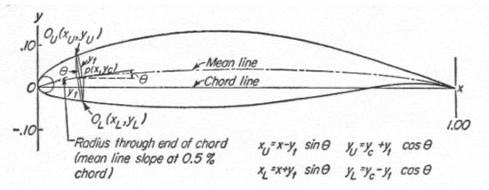

# NACA4-turbo-gmecc
NACA for turbine stages

# Navigation
<!-- TOC -->
* [NACA4-turbo-gmecc](#naca4-turbo-gmecc)
* [Navigation](#navigation)
* [Parameters](#parameters)
* [NACA4 theoretical profile calculation](#naca4-theoretical-profile-calculation)
* [NACA4 turbo](#naca4-turbo)
  * [Calculation of the profile based on the angle of rotation of the flow](#calculation-of-the-profile-based-on-the-angle-of-rotation-of-the-flow)
  * [Coordinate of the top surface of the profile](#coordinate-of-the-top-surface-of-the-profile)
  * [Coordinate of the bottom surface of the profile](#coordinate-of-the-bottom-surface-of-the-profile)
* [Turbine profile](#turbine-profile)
  * [Installation angle](#installation-angle)
  * [Entry angle](#entry-angle)
  * [Exit angle](#exit-angle)
<!-- TOC -->

# Parameters




# NACA4 theoretical profile calculation
```python
pr = NACA4turbo(p=4, t=12)
```


Profile coordinates:

```python
pr.f
```

# NACA4 turbo

```python
from naca4turbo import NACA4turbo
pr = NACA4turbo(p=4, t=10)
pr.profile(m=10)
pr.plot()
```


Profile coordinates:

```python
pr.f
```


## Calculation of the profile based on the angle of rotation of the flow

```python
pr.optim(dalpha=64)
pr.plot()
```


## Coordinate of the top surface of the profile
```python
print([pr.f.xU, pr.f.yU])
```

## Coordinate of the bottom surface of the profile
```python
print([pr.f.xL, pr.f.yL])
pr.plot()
```

# Turbine profile

## Installation angle

## Entry angle

## Exit angle
