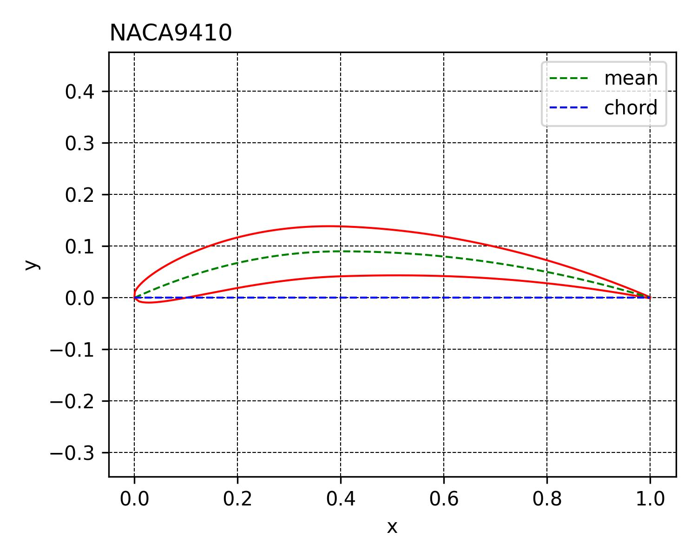
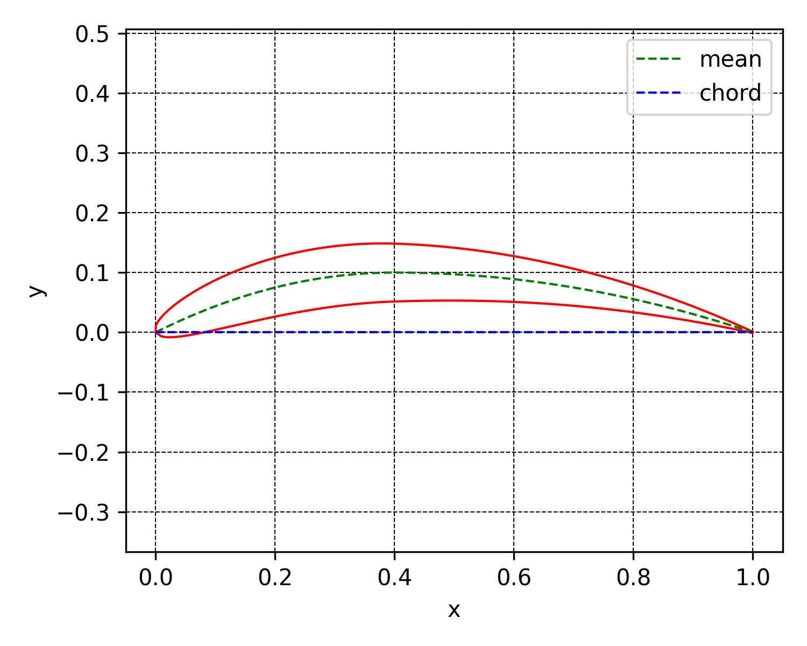
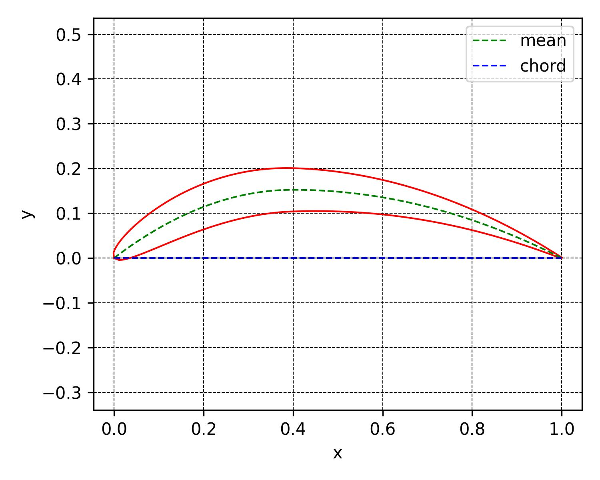

# NACA4-turbo-gmecc
NACA for turbine stages


# NACA4 theoretical profile calculation
```python
pr = NACA4turbo(p=4, t=12)
```


Profile coordinates:

```python
pr.f
```

# NACA4 turbo

```python
from naca4turbo import NACA4turbo
pr = NACA4turbo(p=4, t=10)
pr.profile(m=10)
pr.plot()
```



Profile coordinates:

```python
pr.f
```


# Calculation of the profile based on the angle of rotation of the flow

```python
pr.optim(dalpha=64)
pr.plot()
```



# координата верхней поверхности профиля
```python
print([pr.f.xU, pr.f.yU])
```

# координата верхней поверхности профиля
```python
print([pr.f.xL, pr.f.yL])
pr.plot()
```

Угол установки
Угол входа
Угол выхода

# расчет профиля турбинной решетки