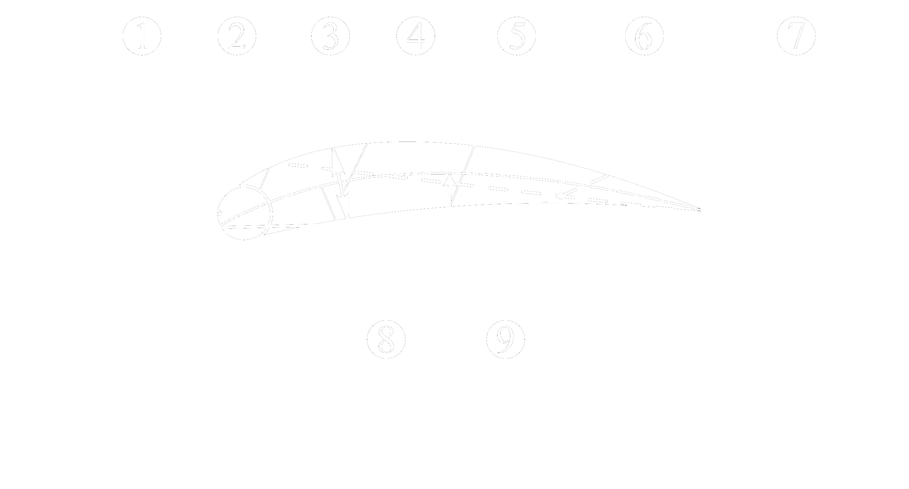

# NACA profile for turbine stages

# Navigation
<!-- TOC -->
* [NACA profile for turbine stages](#naca-profile-for-turbine-stages)
* [Navigation](#navigation)
* [Profile geometry](#profile-geometry)
* [NACA 4 digit airfoil specification](#naca-4-digit-airfoil-specification)
* [NACA4 theoretical profile calculation](#naca4-theoretical-profile-calculation)
  * [Paramerers](#paramerers)
* [NACA4 turbo](#naca4-turbo)
  * [Paramerers](#paramerers-1)
  * [Calculation of the profile based on the angle of rotation of the flow](#calculation-of-the-profile-based-on-the-angle-of-rotation-of-the-flow)
  * [Coordinate of the top surface of the profile](#coordinate-of-the-top-surface-of-the-profile)
  * [Coordinate of the bottom surface of the profile](#coordinate-of-the-bottom-surface-of-the-profile)
* [Turbine profile](#turbine-profile)
  * [Installation angle](#installation-angle)
  * [Entry angle](#entry-angle)
  * [Exit angle](#exit-angle)
<!-- TOC -->

# Profile geometry

NACA stands for the National Advisory Committee for Aeronautics, 
which was a U.S. federal agency founded in 1915 to undertake, 
promote, and institutionalize aeronautical research. It played a 
crucial role in advancing aviation technology, including the 
development of airfoils, which are the cross-sectional shapes 
of wings and other aerodynamic surfaces. The NACA airfoil series 
is a set of standardized airfoil shapes developed by this agency, 
which became widely used in the design of aircraft wings.



Profile geometry:
- 1: Zero-lift line; 
- 2: Leading edge; 
- 3: Nose circle; 
- 4: Max. thickness; 
- 5: Camber; 
- 6: Upper surface; 
- 7: Trailing edge; 
- 8: Camber mean-line; 
- 9: Lower surface

# NACA 4 digit airfoil specification

This NACA airfoil series is controlled by 4 digits e.g. 
NACA 2412, which designate the camber, position of the maximum 
camber and thickness. If an airfoil number is

$$NACA \quad M  P  XX$$

then:
- `M` is the maximum camber divided by 100. In the example M=2 so the camber is 0.02 or 2% of the chord
- `P` is the position of the maximum camber divided by 10. In the example P=4 so the maximum camber is at 0.4 or 40% of the chord.
- `XX` is the thickness divided by 100. In the example XX=12 so the thiickness is 0.12 or 12% of the chord.


# NACA4 theoretical profile calculation

```python
from naca4turbo import NACA4camb
pr = NACA4camb('9410')
pr.plot()
```


Profile coordinates:

```python
pr.f
```

# NACA4 turbo

When calculating the turbine profile, the range of changes 
in maximum camber has been expanded.


## Paramerers

- `p` - the position of the maximum camber divided by 10.
- `m` - the maximum camber divided by 100.
- `t` - the thickness divided by 100.


```python
from naca4turbo import NACA4turbo
pr = NACA4turbo(p=4, t=10)
pr.profile(m=10)
pr.plot()
```


Profile coordinates:

```python
pr.f
```


## Calculation of the profile based on the angle of rotation of the flow

```python
from naca4turbo import NACA4turbo
pr = NACA4turbo(p=4, t=10)
pr.optim(dalpha=64)
pr.plot()
```


## Coordinate of the top surface of the profile
```python
print([pr.f.xU, pr.f.yU])
```

## Coordinate of the bottom surface of the profile
```python
print([pr.f.xL, pr.f.yL])
pr.plot()
```

# Turbine profile

## Installation angle

## Entry angle

## Exit angle
